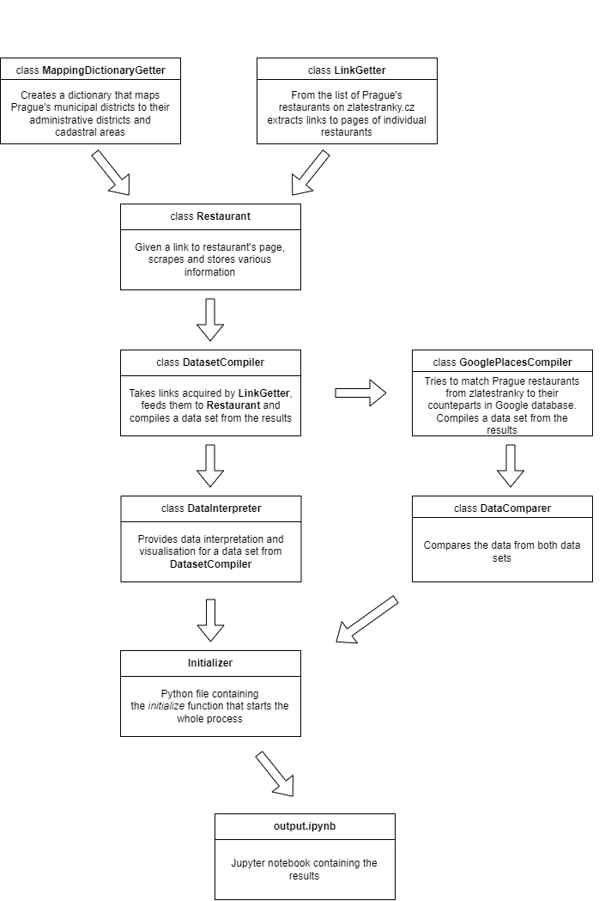

# Final project

### JEM-207 Data processing in Python

Institute of Economic Studies, Faculty of Social Sciences, Charles University

Jan Kubal & Matyáš Mattanelli

---
- The main aim of this project is to create a comprehensive data set of Prague restaurants using the information available at [Zlaté Stránky](https://www.zlatestranky.cz/).
- In addition, it attempts to match each restaurant to its counterpart in the Google database by utilizing the Google Maps Platforms' Places API. Thus, it extends the obtained data set with additional information.
- Lastly, we provide extensive data interpretation, data visualisation, and an interactive tool to scan through our compiled data set.
- The final output of our project is available in [output.ipynb](output.ipynb).
- The compiled data set is available in the following [file](data/restaurants_zlatestranky.csv).

---
### Note on Google Places API

In the selection of variables requested, we were limited by the free billing plan, that Google offers. Despite that, we were able to retrieve information on the number and value of ratings, which might be considered more reliable, than the low amount of ratings on zlatestranky.cz. We decided to match restaurants by their phone number, as it proved to be better than searching by the restaurant's name. Search by name returned more results in total, however, the error rate (not matching the same restaurant correctly) was considerably higher. Also, the name of a restaurant on zlatestranky.cz and on Google Maps is often slightly different, which makes the phone number better matching criterion.